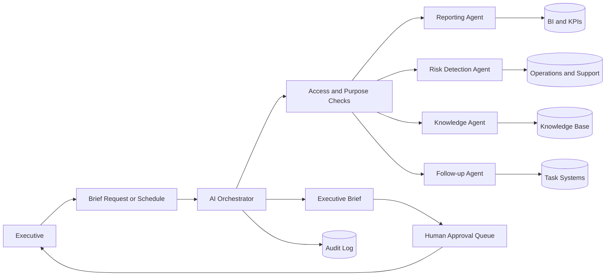

# Executive AI

Reference architecture for an executive AI layer that prepares decision briefs, monitors KPIs, surfaces risks and gives leaders controlled visibility across the organization.

Related MONACOPS page: [Executive AI](https://monacops.com/ai-workforce/executive)

## Business Problem

Executives often rely on manually prepared reports, fragmented updates and delayed escalation paths. Key signals can be spread across CRM, finance, operations, support and documents, which slows decisions and increases the risk of blind spots.

Executive AI acts as a controlled chief-of-staff layer: it consolidates approved data sources, prepares decision briefs, highlights risks and routes sensitive recommendations to human decision-makers.

## Scope

In scope:

- KPI monitoring
- Executive brief generation
- Cross-functional activity summaries
- Risk and anomaly surfacing
- Meeting preparation
- Follow-up tracking
- Escalation routing

Out of scope:

- Autonomous executive decisions
- Financial approvals
- Legal conclusions
- HR decisions
- Unapproved board or client communication
- Any use of confidential data outside approved access boundaries

## Actors

- CEO or executive stakeholder
- Department owner
- Executive assistant or chief of staff
- AI orchestrator
- Reporting agent
- Risk detection agent
- Knowledge retrieval agent
- Task follow-up agent

## Data Sources

- CRM and pipeline reports
- Finance summaries
- Operations dashboards
- Support and client experience metrics
- Project management systems
- Meeting notes
- Approved knowledge base
- Policy and escalation rules

## Integrations

- Business intelligence dashboards
- CRM
- Finance or ERP system
- Project management tools
- Calendar and meeting notes
- Document management system
- Identity provider
- Audit and observability stack

## Orchestration Flow

1. Scheduler or executive request triggers a brief generation workflow.
2. Orchestrator retrieves approved data based on role and purpose.
3. Reporting agent summarizes KPI changes and operational activity.
4. Risk agent identifies anomalies, missing updates and escalation candidates.
5. Knowledge agent attaches relevant context, definitions and prior decisions.
6. Executive brief is generated with source references, confidence and open questions.
7. Sensitive recommendations are routed to human review before action.
8. Follow-up agent tracks approved tasks and reports completion status.

## Human Approval Points

- Sending executive summaries externally
- Assigning tasks to teams
- Escalating sensitive client, financial, legal or HR topics
- Changing KPI definitions
- Updating official records
- Recommending material business decisions

## Security Boundaries

- Executives and agents see only data approved for their role.
- Department-level access rules are enforced before retrieval.
- Agent output includes source traceability.
- Sensitive recommendations are draft-only until approved.
- Audit logs record retrieval, generation, approval and follow-up actions.

## Observability

Track:

- Sources used per brief
- Data freshness
- Missing source warnings
- Risk alerts created and resolved
- Human approval latency
- Brief acceptance and correction rate
- Follow-up completion status
- Policy gate activations

## Failure Modes

- Stale dashboard data
- Missing department update
- Conflicting KPI values
- Overconfident risk classification
- Retrieval of irrelevant context
- Calendar or document system outage
- Approval queue delay

Fallback behavior should label uncertainty, cite missing sources, avoid decisions and route the case to the responsible human owner.

## Evaluation Metrics

- Brief factual accuracy
- Source citation completeness
- KPI change detection accuracy
- Risk alert precision
- Executive correction rate
- Time saved in meeting preparation
- Approval compliance for sensitive recommendations
- Follow-up completion visibility

## Limitations

Executive AI improves information preparation and visibility; it does not replace executive judgment, fiduciary responsibility, legal review or financial approval processes.

## Mermaid Architecture Diagram

See [architecture.mmd](architecture.mmd).

## Additional Documents

- [Security model](security.md)
- [Evaluation plan](evaluation.md)
- [Mermaid source](architecture.mmd)
