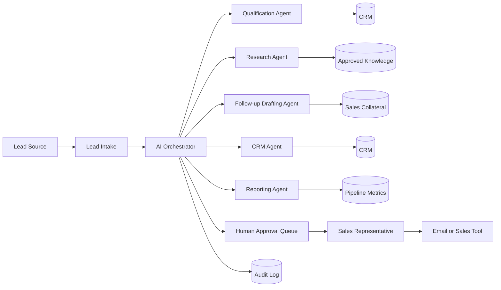

# Sales AI

Reference architecture for a secure sales AI workforce that qualifies leads, drafts personalized follow-ups, updates CRM records and identifies high-value opportunities under human supervision.

Related MONACOPS page: [Sales AI](https://monacops.com/ai-workforce/sales)

## Business Problem

Sales teams lose momentum when inbound leads wait too long, CRM records are incomplete, follow-ups are generic and opportunity signals are buried across email, forms, calls and spreadsheets.

Sales AI coordinates controlled agents that triage leads, enrich context, propose next actions, draft personalized messages and keep pipeline records current while requiring human approval for client-facing and commercially sensitive actions.

## Scope

In scope:

- Inbound lead qualification
- Lead enrichment from approved sources
- Follow-up drafting
- CRM update proposals
- Opportunity scoring
- Meeting preparation
- Task creation
- Pipeline reporting

Out of scope:

- Autonomous pricing offers
- Binding commercial commitments
- Unapproved outbound campaigns
- Legal or compliance advice
- Use of personal data without lawful basis
- Fabricated personalization or claims

## Actors

- Prospect or client
- Sales representative
- Sales manager
- Revenue operations owner
- AI orchestrator
- Lead qualification agent
- Research agent
- Follow-up drafting agent
- CRM agent
- Reporting agent

## Data Sources

- Website forms
- Shared sales inboxes
- CRM
- Approved company knowledge base
- Product or service collateral
- Meeting notes
- Historical approved sales communications
- Pipeline reports

## Integrations

- CRM
- Email
- Calendar
- Website form system
- Sales engagement platform where approved
- Task management tool
- Knowledge base
- Identity provider
- Audit and observability stack

## Orchestration Flow

1. Lead intake event triggers classification and duplicate detection.
2. Qualification agent extracts company, role, need, urgency, budget signals and missing information.
3. Research agent enriches the account using approved sources.
4. Scoring policy ranks the opportunity and explains the score.
5. Follow-up agent drafts a personalized response grounded in approved facts.
6. CRM agent proposes record updates and next tasks.
7. Sales representative reviews and approves client-facing communication and CRM changes.
8. Reporting agent summarizes pipeline movement and response performance.

## Human Approval Points

- Sending outbound emails or messages
- Updating material CRM fields
- Changing opportunity stage
- Creating pricing or proposal language
- Disqualifying strategic leads
- Launching sequences or campaigns
- Making claims about capability, timelines or expected ROI

## Security Boundaries

- Agents operate with scoped read and write permissions.
- External research is separated from internal instructions and policies.
- CRM write-back requires approval for material fields.
- Personal data processing must follow applicable privacy requirements.
- All scoring, drafts and updates are auditable.

## Observability

Track:

- Lead source and classification
- Duplicate detection outcomes
- Score explanation and changes over time
- Draft acceptance and edit rate
- CRM update approval rate
- Time to first approved response
- Disqualification reasons
- Policy gate activations
- Integration errors

## Failure Modes

- Duplicate lead ambiguity
- Missing or incorrect contact details
- Low-confidence qualification
- Unsupported personalization source
- CRM unavailable
- Inbound prompt injection attempt
- Sales representative approval delay
- Incorrect or outdated service collateral

Fallback behavior should preserve the lead, avoid sending communication, notify the sales owner and mark the reason for manual review.

## Evaluation Metrics

- Lead classification accuracy
- Field extraction precision and recall
- Duplicate detection accuracy
- Draft acceptance rate
- CRM update acceptance rate
- Time to first approved response
- Opportunity score calibration against human review
- Policy compliance for client-facing communication

## Limitations

Sales AI can improve workflow consistency and responsiveness, but it does not guarantee revenue, conversion rates or pipeline growth. Any performance assessment must be based on measurable, documented evaluation in the target organization.

## Mermaid Architecture Diagram

See [architecture.mmd](architecture.mmd).

## Additional Documents

- [Security model](security.md)
- [Evaluation plan](evaluation.md)
- [Mermaid source](architecture.mmd)
