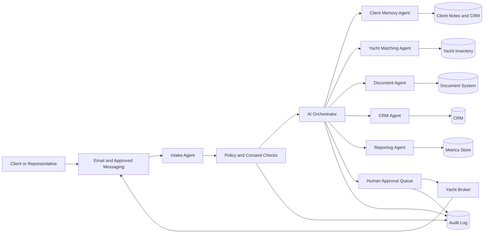

# Yachting AI Operating System

Reference architecture for a secure Agentic AI Operating System serving yacht brokerages, charter teams and luxury maritime operators.

Related MONACOPS page: [Yachting & Brokerage](https://monacops.com/industries/yachting-brokerage)

## Business Problem

Yachting teams manage high-value inquiries across email, messaging, CRM records, vessel documentation, preferences, calendars and follow-up workflows. Important details can be scattered across tools, response times can vary, and brokers often lose senior time to repetitive administrative coordination.

The Yachting AI Operating System coordinates a controlled AI workforce that assists brokers with inquiry triage, client preference memory, vessel matching, document preparation, follow-up drafting and operational reporting while keeping sensitive actions under human approval.

## Scope

In scope:

- Inbound inquiry triage and qualification
- Client preference extraction and retrieval
- Yacht or charter option shortlisting
- Follow-up drafting
- CRM enrichment and task creation
- Document checklist preparation
- Broker briefing and executive visibility
- Escalation to human owners

Out of scope:

- Autonomous contract signing
- Autonomous pricing commitments
- Legal advice
- Financial transaction execution
- Unapproved outbound communication
- Processing client data without a lawful basis and access controls

## Actors

- Client or representative
- Yacht broker
- Charter manager
- Operations coordinator
- Compliance or administrative reviewer
- Executive stakeholder
- AI orchestrator
- Specialized AI agents for intake, matching, documents, CRM, reporting and support

## Data Sources

- Shared inboxes and approved messaging channels
- CRM records
- Yacht inventory or listing systems
- Client preference notes
- Historical inquiries and approved communications
- Contract templates and document checklists
- Calendar availability
- Internal playbooks and escalation policies

## Integrations

- Email and approved messaging tools
- CRM
- Document management system
- Calendar
- Yacht inventory or listing database
- Task management system
- Identity provider and access control layer
- Observability and audit logging stack

## Orchestration Flow

1. Intake agent classifies the inquiry, extracts structured fields and checks consent and routing rules.
2. Client memory agent retrieves relevant preferences and relationship context from approved systems.
3. Matching agent proposes yacht or charter options using inventory constraints and client preferences.
4. Document agent prepares a checklist and drafts required non-binding materials.
5. CRM agent proposes record updates, tasks and next steps.
6. Broker receives a briefing with confidence scores, missing information and recommended actions.
7. Human approval is required before outbound messages, commitments, record changes with material impact or document release.
8. Reporting agent summarizes activity, bottlenecks and response metrics for managers.

## Human Approval Points

- Sending external messages
- Sharing yacht options with pricing or availability
- Updating client-critical CRM fields
- Releasing documents
- Escalating legal, compliance or payment topics
- Marking an opportunity as disqualified
- Creating commitments on behalf of the brokerage

## Security Boundaries

- Agents use least-privilege scoped access.
- Client data remains inside approved systems.
- Retrieval is limited by role, purpose and data classification.
- Write operations use approval queues where risk is material.
- Sensitive data is redacted in logs where possible.
- Every agent action is recorded with actor, timestamp, source, target and outcome.

## Observability

Track:

- Inquiry volume and classification distribution
- Time to first broker-ready draft
- Human approval latency
- Retrieval sources used by each response
- CRM update proposals accepted or rejected
- Escalation rate
- Failure and fallback rate
- Policy violations blocked

## Failure Modes

- Missing or conflicting client preferences
- Inventory system unavailable
- Low-confidence yacht matching
- Ambiguous pricing or availability
- Duplicate CRM records
- Messaging integration failure
- Prompt injection attempt in inbound content
- Human approval timeout

Fallback behavior should route the case to a broker, preserve the current state, log the reason and avoid sending external communication automatically.

## Evaluation Metrics

- Classification precision and recall on inquiry types
- Preference extraction accuracy
- Yacht match relevance judged by brokers
- Draft follow-up acceptance rate
- CRM update acceptance rate
- Reduction in manual administrative steps
- Mean time from inquiry receipt to broker-ready briefing
- Human approval compliance rate
- Policy violation detection rate

## Limitations

This reference architecture does not guarantee commercial outcomes, response-time improvements or conversion lift. Actual performance depends on data quality, integration maturity, broker workflow adoption, access controls and evaluation discipline.

## Mermaid Architecture Diagram

See [architecture.mmd](architecture.mmd).

## Additional Documents

- [Security model](security.md)
- [Evaluation plan](evaluation.md)
- [Mermaid source](architecture.mmd)
